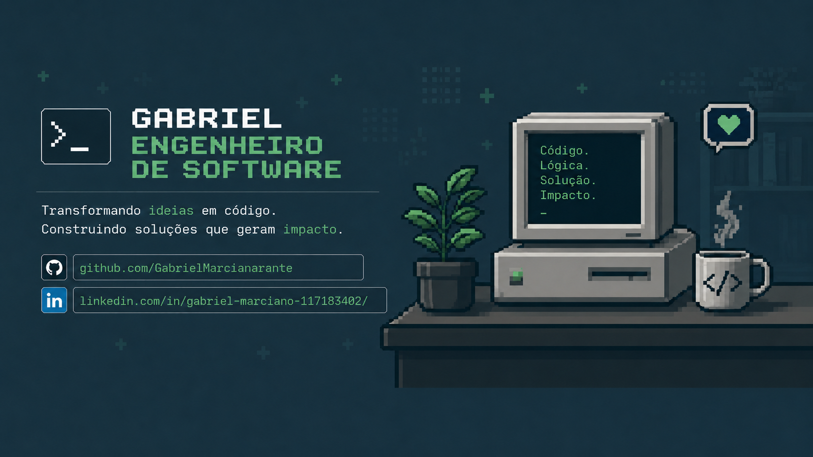

# Gabriel Marciano

**Desenvolvedor Back-end · Estudante de Engenharia de Software**

---

## Sobre

Desenvolvedor back-end focado em APIs, sistemas escaláveis e arquitetura de software.

Atualmente cursando Engenharia de Software no CEUB e desenvolvendo projetos com Node.js, Python, PostgreSQL e Docker.

Buscando uma oportunidade de estágio em desenvolvimento back-end para evoluir tecnicamente e contribuir em projetos reais.

---

## Stack

### Linguagens

### Back-end

### Banco de Dados & Ferramentas

---

## Projetos

### Plataforma Online Judge
Plataforma de programação competitiva inspirada em LeetCode e Codeforces.

- Execução de código isolada com Docker
- Resultados em tempo real com Socket.io
- Node.js, Express, PostgreSQL e Prisma

### Sistema de Radar em Tempo Real
Simulação de radar utilizando dados da OpenSky API.

- Detecção de ameaças e cálculos de interceptação
- Visualização interativa em mapa
- Python e Flask

### API SaaS Multi-Tenant
Arquitetura de API SaaS para microempresas.

- Autenticação e controle de permissões
- Estrutura multi-tenant
- TypeScript, Express e PostgreSQL

---

## Estatísticas GitHub

---

Aberto para oportunidades de estágio em desenvolvimento back-end.

